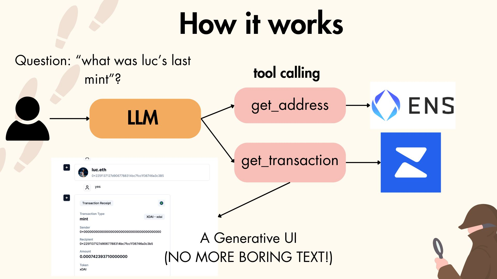
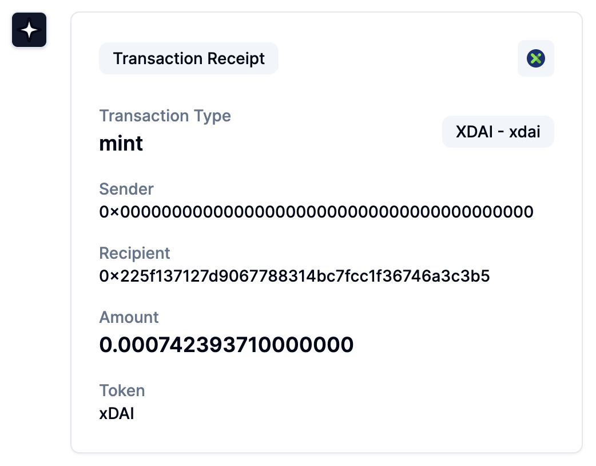

# Block Whisperer by DappaDan
### AI Powered Web3 Search 

## How it works 
**Step 1:** User asks a question. Example "What was Lucs's Last Mint?" 

**Step 2:** The Large Language Model (GPT-4o) takes this question and decides what functions/tools are needed to answer this question. 

**Step 3:** The functions are then run. In this example: **First** the LLM will lookup an ENS related to Luc. 

**Step 4:** The LLM will present a Generative UI element to the user with Lucs's ENS name on it to get confirmation from the user. 

**Step 5:** An API request will be sent using the Wallet Address of Kartik to the **Zerion API**. This will include the `operation_type` being mint. 

**Step 6:** Then the LLM will Genearte a UI element to the user with the transaction data of Kartik's last mint.

## Technologies Used 
### Web3 Related 
**Zerion API** - Used for the getting data about wallets including crypto owned, nfts owned and transactions. 

**ENS Lookup** - Used to lookup ENS names to wallet addresses that are required for API calls. Also used to get social accounts of an ENS. 

**Coinmarket Cap API** - Used to get the stats of the a give cryptocurrency. 

### Non-Web3 
**GPT4o** - The Large Language model powering the natural language experience. 

**Vercel AI SDK** - Used to create Generative UI elements. This gives an enhanced user experience instead of dealing with text. 

**Tool Invocaction** - Through the Vercel AI SDK, the LLM can make tool calls and run functions to get answers for users. 

## What Can You Ask
- Lookup the Wallet Address for an ENS
- Find the social accounts of an ENS 
- Find the NFTs Owned by a ENS
- Find the Crypto Owned by a ENS 
- Find the transactions by a ENS
- Find a specific transaction by an ENS 
- Find details on a certain token

## Whats's Next?
Integrating DeFi data for questions like "What was my best trade?" 